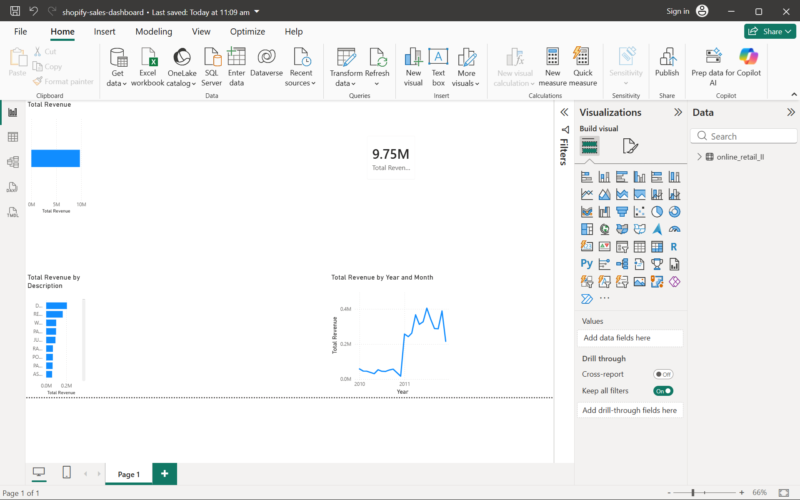

# Shopify Sales Analysis Dashboard (Power BI)

Interactive Power BI dashboard analyzing e-commerce sales data using the Online Retail II dataset.

## Dashboard Preview

## Tools Used
- Power BI Desktop
- Power Query (data cleaning)
- DAX measures

## Key Metric
Total Revenue = SUMX(online_retail_II, online_retail_II[Quantity] * online_retail_II[Price])

## Dashboard Components
1. Total Revenue KPI Card
2. Total Revenue by Country
3. Total Revenue by Year and Month
4. Top 10 Products by Revenue

## Author
Omkar Lakavath - IIT Madras
